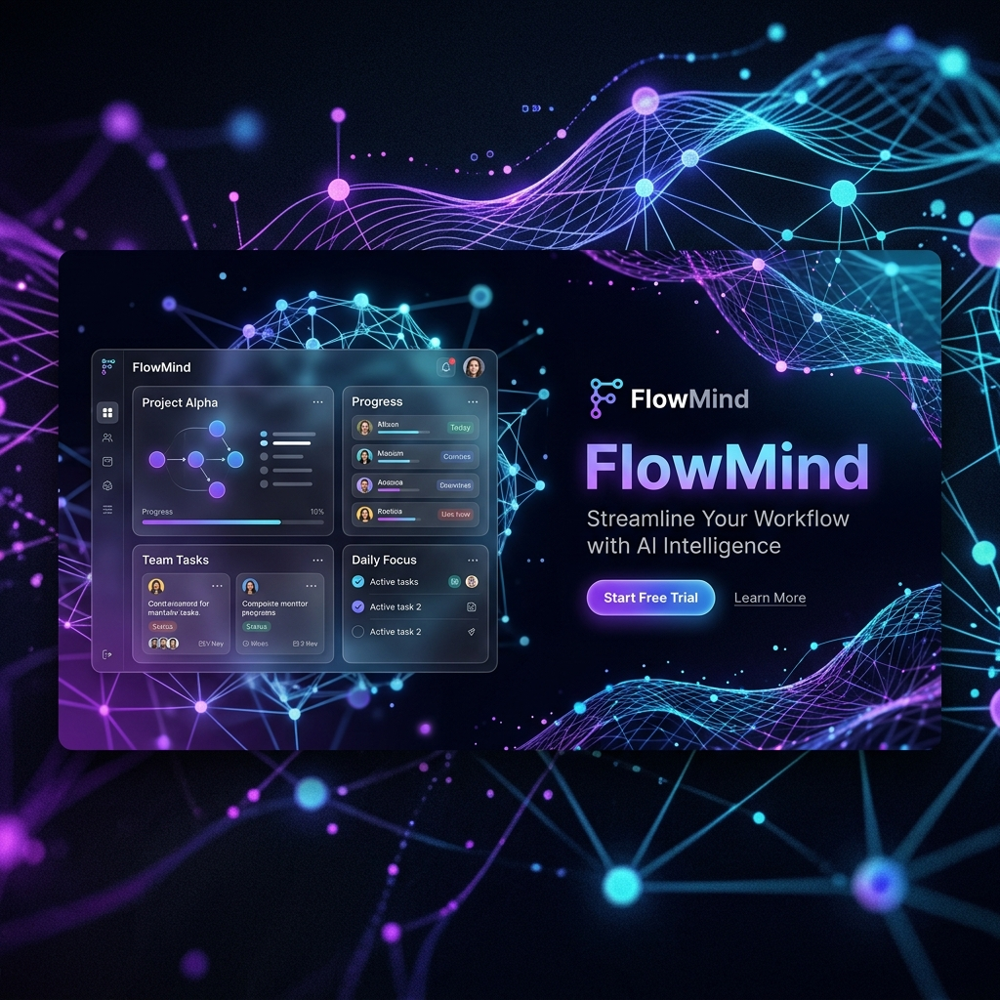

# FlowMind: AI-Driven Task Intelligence 🧠🚀



FlowMind is a premium, high-fidelity task management platform that leverages the power of Google Gemini AI to transform how you manage productivity. With a cinematic glassmorphic interface and deep AI insights, FlowMind isn't just a task list—it's your intelligent workspace.

---

## ✨ Key Features

- **🧠 AI Task Intelligence**: Automated task breakdown, priority estimation, and workload analysis using Google Gemini.
- **📊 Advanced Analytics**: Real-time productivity trends, cognitive load distribution, and task density visualizations.
- **🎨 Cinematic UI**: A professional-grade, dark-themed glassmorphic interface built with Framer Motion and Tailwind CSS.
- **📱 Fully Responsive**: Seamless experience across desktop, tablet, and mobile devices.
- **⚡ Real-time Sync**: Persistent task management backed by MongoDB.

---

## 🛠️ Tech Stack

### Frontend
- **Framework**: React 18 + Vite
- **Styling**: Tailwind CSS (Custom Design System)
- **Animations**: Framer Motion
- **Icons**: Lucide React
- **Charts**: Recharts / Custom SVG Analytics

### Backend
- **Server**: Flask (Python)
- **AI Engine**: Google Gemini API (`google-genai`)
- **Database**: MongoDB
- **Auth**: JWT-based Secure Authentication

---

## 🚀 Getting Started

### Prerequisites
- Python 3.9+
- Node.js 18+
- MongoDB Instance (Atlas or Local)
- Google Gemini API Key

### 1. Backend Setup
```bash
cd backend
python -m venv .venv
source .venv/bin/activate  # Windows: .venv\Scripts\activate
pip install -r requirements.txt
cp .env.example .env
# Edit .env with your credentials
python app.py
```

### 2. Frontend Setup
```bash
cd frontend
npm install
npm run dev
```

---

## 📁 Project Structure

```text
task-manager/
├── backend/            # Flask API & AI Services
│   ├── routes/         # API Endpoints (Tasks, Analytics, AI)
│   ├── services/       # Core Logic (Gemini Integration)
│   ├── models/         # MongoDB Schemas
│   └── app.py          # Entry Point
├── frontend/           # React + Vite Application
│   ├── src/
│   │   ├── components/ # Reusable UI Components
│   │   ├── pages/      # View Modules
│   │   └── demo/       # Simulated Workspace Components
│   └── tailwind.config.js
└── assets/             # Project Branding & Media
```

---

## 🛡️ License
Distributed under the MIT License. See `LICENSE` for more information.

---

<p align="center">
  Built with ❤️ for the future of productivity.
</p>
